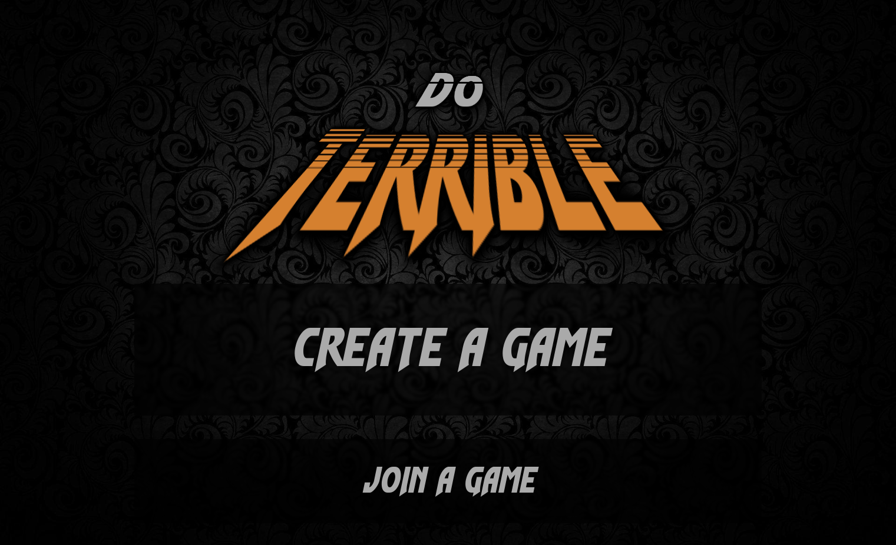
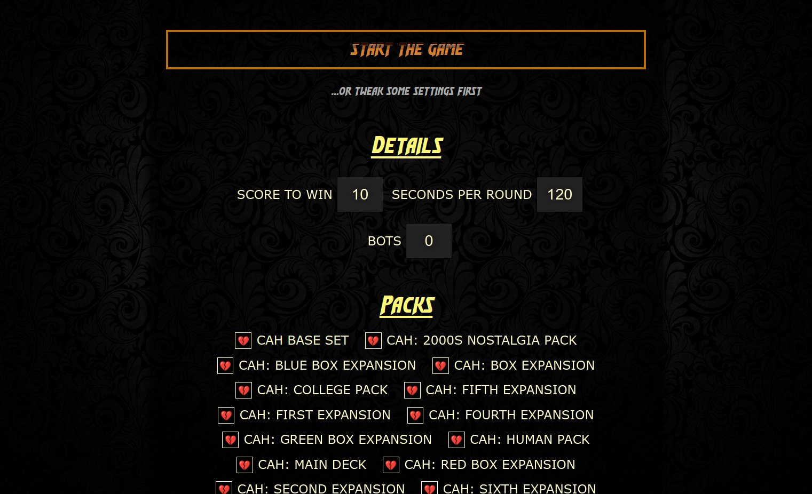
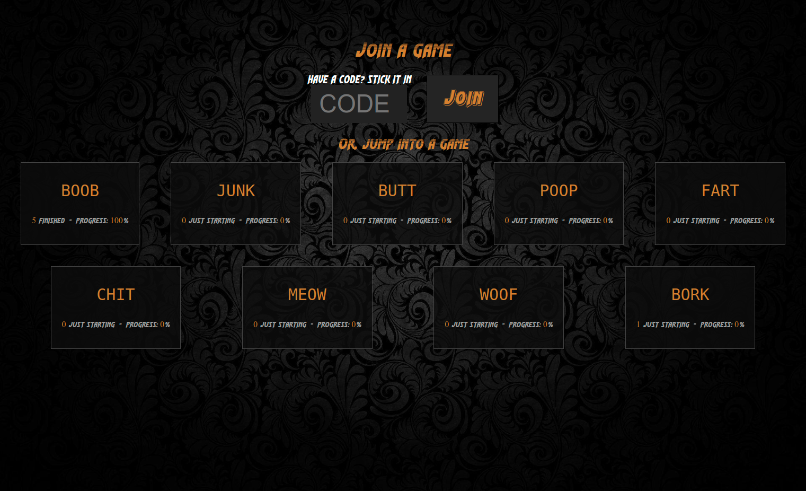
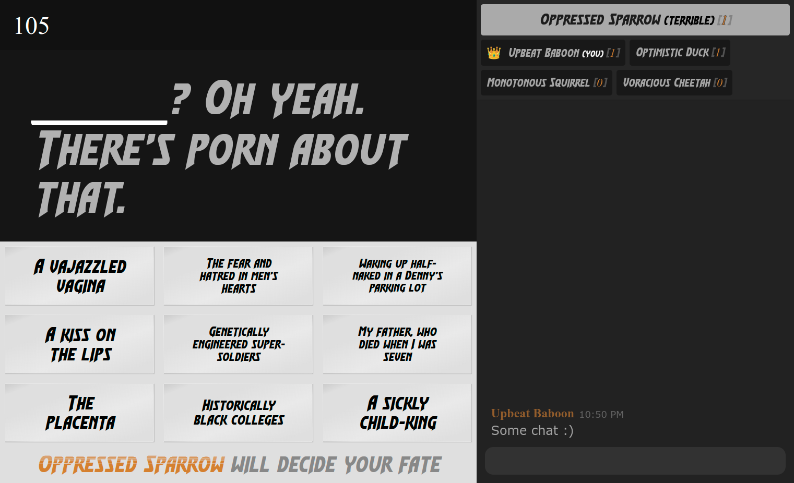

# Welcome and Do Terrible!

Do Terrible is a **Commentary Game**. You might have heard of another similar game called Cards
Against Humanity. I want to make it **absolutely clear** that I have nothing to do with them.

An instance of the game is hosted at https://doterrible.com. Have fun!

## JS not required (and other marvels)

The game is perfectly playable including real-time game state updates and chat (with autoscroll
and user name/presence updates) even when JavaScript is disabled.

I found the [(Ab)use the Platform](https://github.com/jenseng/abuse-the-platform) project very
inspirational and I've always fancied the idea of doing things without requiring script. This
project is a successful experiment in delivering a polished real-time gaming experience without requiring
a client to execute any script whatsoever.

A list of interesting technologies and techniques used in this project:

- [Remix](https://remix.run)
- [Vite](https://vitejs.dev/)
- [Forms](https://developer.mozilla.org/en-US/docs/Web/HTML/Element/form)
- [Progressive enhancement](https://developer.mozilla.org/en-US/docs/Glossary/Progressive_Enhancement)
- [Response](https://developer.mozilla.org/en-US/docs/Web/API/Response), [Server-sent events](https://developer.mozilla.org/en-US/docs/Web/API/Server-sent_events/Using_server-sent_events), and [long polling](https://javascript.info/long-polling) including at the [top level](./app/utils/top-level-long-poll.js) to transform the
[React pipeable stream](https://react.dev/reference/react-dom/server/renderToPipeableStream)
output
- [Algorithm L reservoir sampling](https://en.wikipedia.org/wiki/Reservoir_sampling#Optimal:_Algorithm_L)
  to efficiently generate custom decks for each game from a large pool of packs
- Dynamic text scaling (when scripts are enabled)

## Screenshots






## Running locally

### Install

Install the dependencies with `npm`:

```sh
npm install
```

### Get some packs

You must install some packs before you can play. Check out
https://github.com/crhallberg/json-against-humanity and copy e.g. `cah-all-full.json` to the
`data/packs` directory.

**NOTE**: The grammatical quality of many of those packs (even/especially the Official™ ones)
leaves a great deal to be desired.

### Play

Finally, you may:

```sh
npm run dev
```

to run a dev server.

## Production build

```sh
npm run build
```

After that, you're on your own, hero. :slightly_smiling_face:

## Hey, you screwed up [whatever]

Probably! Feel free to create issues and tell me what I screwed up. :) The no-js acrobatics are
probably terrible for accessibility. I'd love to know how to improve!
